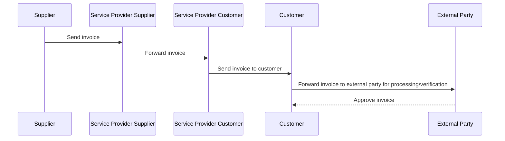
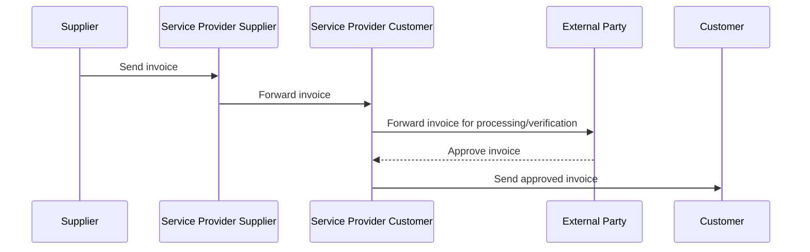
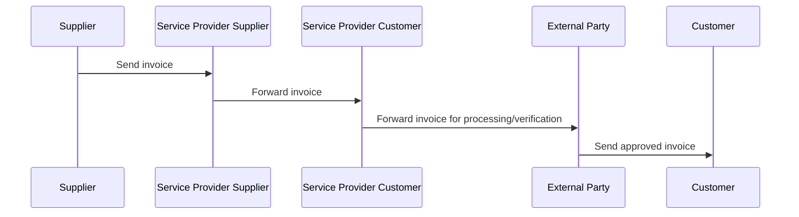

## Scenario 1: Customer receives invoice and forwards it to the external party

#### Description
The customer receives the invoice via the service provider and then forwards it to the external party for processing/verification or other purposes.

#### Advantages:
+ Simple implementation without changes on the side of the service provider.
+ Customer retains control over which invoices are forwarded.

#### Challenges:
+ Extra implementation required from the customer.

## Scenario 2: Integration between the Service Provider and the External Party

### 2.1 - Asynchronous integration

#### Description
The Service Provider of the Customer (corner 3) first forwards the received invoice to an External Party for processing/verification. Forwarding by the Service Provider is done based on invoice type (f.e. energy invoice) or based on Supplier identification. After approval by the External Party, the invoice is sent to the Customer (corner 4) by the Service Provider (corner 3).

##### Advantages:
+ Automated workflow within the Service Provider of the Customer.
+ Efficient process if supported by the service provider.

##### Challenges:
+ Not all service providers are capable of offering this functionality.
+ Process agreements are necessary between both customer and service provider, and customer and external party.

### 2.2 - Synchronous integration

#### Description
The service provider of the customer automatically performs a validation of the received invoice by calling an API/webservice of the external party before it is sent to the customer.

##### Advantages:
+ Fully automated and fast process.
+ No involvement of third parties required.

##### Challenges:
+ Service provider must have advanced validation capabilities.
+ Limited flexibility if validation criteria change.

## Scenario 3: Service Provider routes invoices through external party 

#### Description
The Service Provider of the Customer (corner 3) first forwards the received invoice to an External Party for processing/verification. Forwarding by the Service Provider is done based on invoice type (f.e. energy invoice) or based on Supplier identification. After processing/approval by the External Party, the invoice is sent to the Customer (corner 4) by the External Party.

##### Advantages:
+ Automated workflow within the Service Provider of the Customer.
+ Efficient process if supported by the service provider.
+ Process agreement is less complex than in scenario 2.

##### Challenges:
+ Not all service providers are capable of offering this functionality.